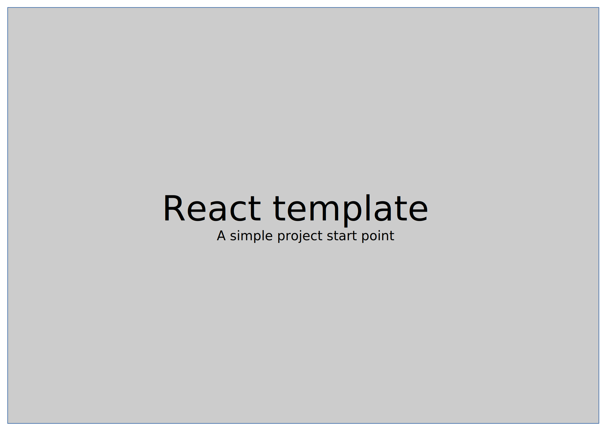

# React boilerplate

## About
This project is a start point to make small projects creation faster without a lot of resources like [create-react-app](https://github.com/facebook/create-react-app).

## Installation
Just execute `npm install`.

## How to use
Some helpful `npm` commands in this project:
* `start`: start webpack watch on project files and serve using [WPS](https://github.com/shellscape/webpack-plugin-serve)
* `build`: creates a production build of the project 
  * Comments removed
  * JSX processed with [Babel loader](https://github.com/babel/babel-loader)
  * Uglified with [Terser Webpack Plugin](https://github.com/webpack-contrib/terser-webpack-plugin)
  * Minified with [Mini CSS extract plugin](https://github.com/webpack-contrib/mini-css-extract-plugin)
  * CSS modules activated with [CSS loader](https://github.com/webpack-contrib/css-loader)
  * Dinamic `index.html` created with [Html webpack plugin](https://github.com/jantimon/html-webpack-plugin)
* `test`: executes [Jest](https://jestjs.io/) in a jsdom environment
* `lint`: executes [ESlint](https://eslint.org/) personalized code style
  * `lint:fix`: executes autofix
